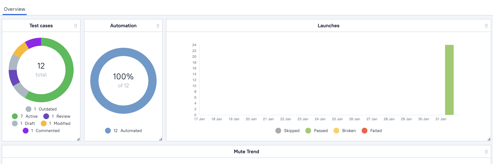

# http://realworld.io (medium clone) automated tests

## Covered features:

- Auth and registration (API + UI)
- Edit profile (UI)
- Create/Get/Update/Delete articles (API)


### Libraries have been used in this project

<p  align="left">
<code>


</code>
</p>

# USAGE examples

### For run tests need to select build params:

* browser
* browserVersion
* browserSize
* remoteDriverUrl (url address from selenoid or grid)
* environment
* comment (for telegram notification)
* threads (number of threads)

Run tests with filled remote.properties:

```bash
gradle clean test
```

Run tests with not filled remote.properties:

```bash
gradle clean -DremoteDriverUrl=https://%s:%s@selenoid.autotests.cloud/wd/hub/ -DvideoStorage=https://selenoid.autotests.cloud/video/ -Dthreads=1 test
```
Usually, tests run on the Selenoid.
>Selenoid is one of implementation of original Selenium hub. It is using Docker to launch browsers. 


# Jenkins
>Jenkins – an open source automation server which enables developers around the world to reliably build, test, and deploy their software

## Jenkins job
Example of Jenkins job that executes tests
<a target="_blank" href="https://jenkins.autotests.cloud/job/09-Oleynik_Vladimir/">click here to open jenkins job</a>

## Jenkins parameters
You can change this params to run test on different environments, browsers, etc...

<p  align="left">
<code>

</code>
</p>

# Allure
> Allure Framework is a flexible lightweight multi-language test report tool that not only shows a very concise representation of what have been tested in a neat web report form, but allows everyone participating in the development process to extract maximum of useful information from everyday execution of tests.

## Allure TestOps
> Allure TestOps is a refined Test Operations Swiss army knife which allows you to manage all test related stuff in one place.

## Test Cases
> Test case management
<p  align="left">
<code>

</code>
</p>

## Dashboard
> Dashboard with statuses of testcases on Allure TestOps
<p  align="left">
<code>

</code>
</p>

## Allure overview
> Different charts, metrics and statistic to easily analyze tests result
<p  align="left">
<code>

</code>
</p>

## Allure test result
> Here is a result of test executing.  
<p  align="left">
<code>

</code>
</p>

## Allure video result
> You can see a short video how tests executes on Selenoid server
<p  align="left">
<code>

</code>
</p>

## Jira Integration
> All test integrated with jira to check statuses and activity
<p  align="left">
<code>

</code>
</p>

# Telegram notification
> We use telegram bot to send test result to specified telegram channel
<p  align="left">
<code>

</code>
</p>
